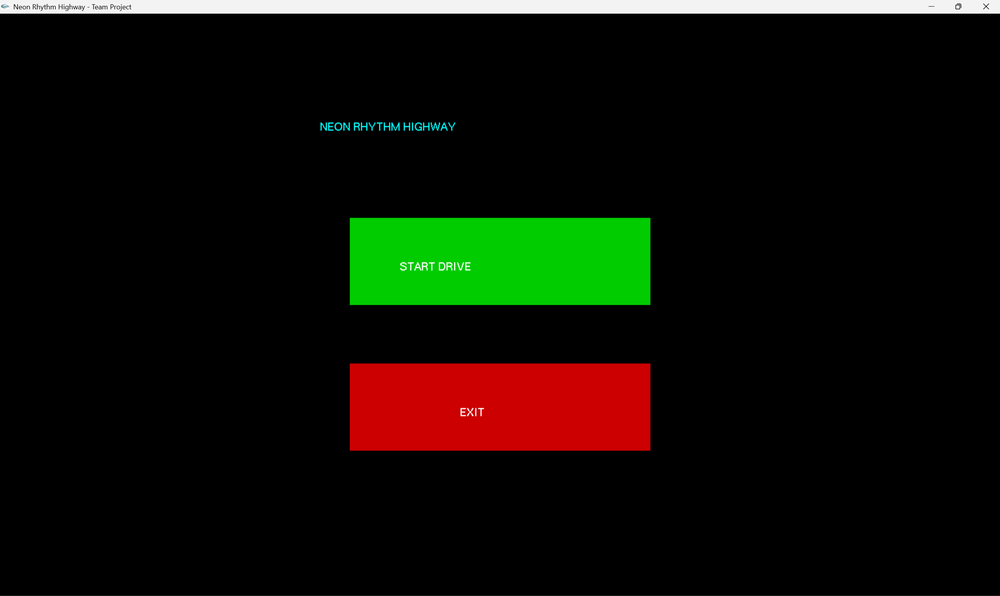
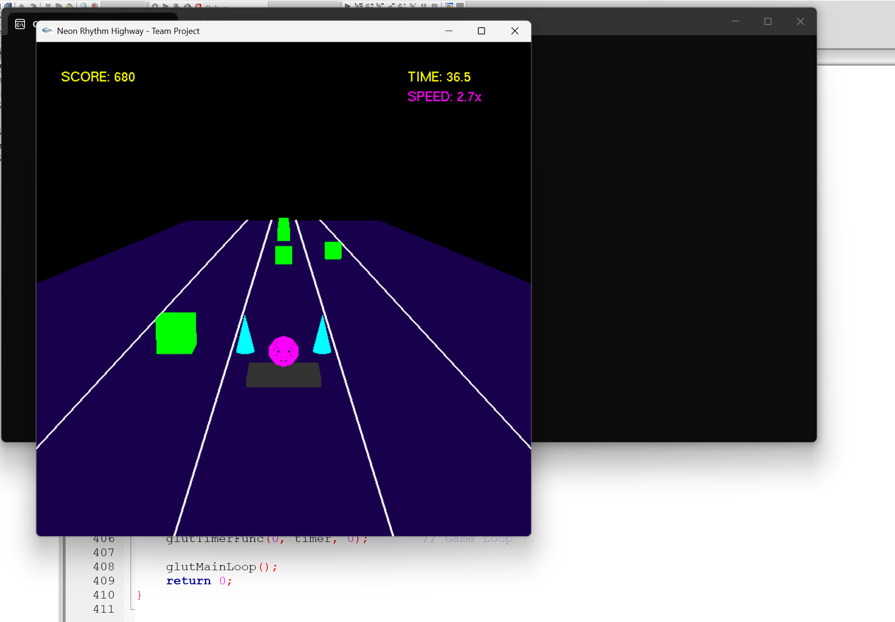
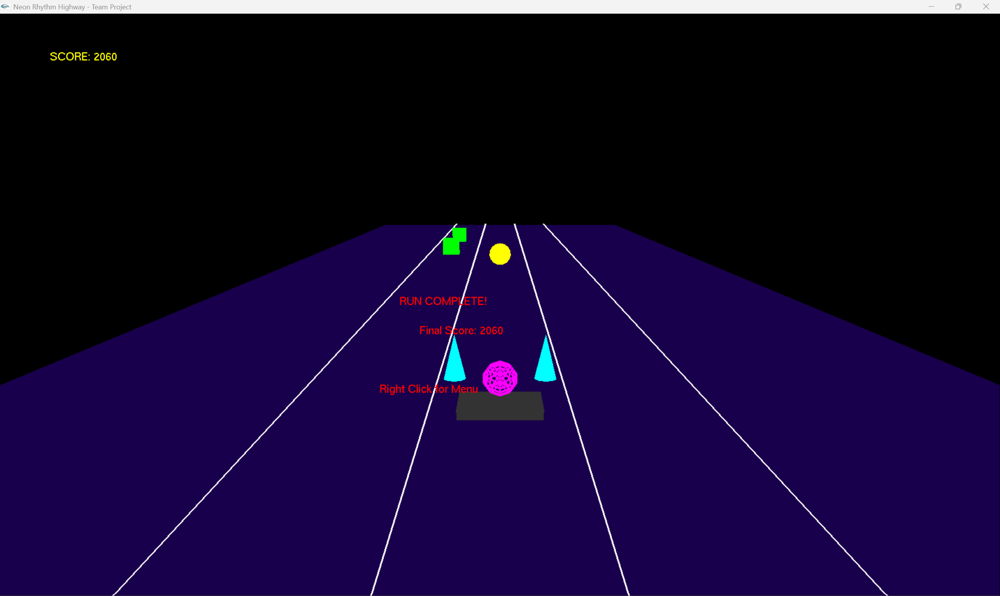

# Neon Rhythm Highway

A 3D neon lane-catcher rhythm game built in C++ with OpenGL and GLUT.

## Overview

Neon Rhythm Highway is a small 3D arcade game where you steer a neon "catcher"
across three lanes and grab falling notes during a timed 60-second run. It was
built as a hands-on way to learn real-time 3D graphics, input handling, and game
loops using OpenGL and GLUT. The game combines a mouse-driven menu, a live
heads-up display, and a 3D gameplay view in a single program.

## How to Play

- From the menu, click **START DRIVE** to begin a run.
- Use the **Left** and **Right** arrow keys to move the catcher between the three lanes.
- Line the catcher up with the falling notes to collect them before they pass.
- Each run lasts 60 seconds. When time runs out, your final score is shown.

## Scoring

- **Green cube** — 10 points
- **Gold sphere (bonus)** — 50 points

As the clock counts down, both the speed of the notes and how often they appear
increase, so the run gets progressively harder.

## Controls

| Action | Control |
| --- | --- |
| Start a run | Left-click **START DRIVE** |
| Quit the game | Left-click **EXIT** |
| Move left / right | Left / Right arrow keys |
| Return to menu (after a run) | Right-click |

## Key Features

- A three-lane 3D highway rendered with a perspective camera.
- A player "catcher" built from several 3D primitives (a box base, two cones, and a sphere core).
- Falling notes of two kinds: standard cubes and higher-value bonus spheres.
- A 60-second timed run with dynamic difficulty — speed and note frequency rise as time decreases.
- A mouse-driven menu (Start / Exit) and a live HUD showing score, time remaining, and current speed.
- A game-over screen showing the final score, with a right-click to return to the menu.
- Separate rendering modes in one program: 2D (orthographic) for the menu and HUD, 3D (perspective) for gameplay.
- Optional sound effects on Windows for catching a note and finishing a run.

## Tech Stack

- **Language:** C++
- **Graphics:** OpenGL (rendering) with GLU (`gluPerspective`, `gluOrtho2D`, `gluLookAt`)
- **Windowing / input / game loop:** GLUT (FreeGLUT)
- **Sound (Windows only):** Windows Multimedia API (`winmm`)
- **IDE / compiler:** Code::Blocks 16.01 with the MinGW GCC compiler

## How to Run

This project was developed and run on Windows using Code::Blocks 16.01 with the
MinGW GCC compiler.

1. Install **Code::Blocks** with the **MinGW GCC** compiler.
2. Set up **GLUT / FreeGLUT** for MinGW: place the GL headers, the library files, and
   `freeglut.dll` where your compiler and system can find them.
3. Create a new C++ project and add `main.cpp` to it.
4. Link the required libraries: `opengl32`, `glu32`, and `freeglut` (or `glut32`).
   On Windows, `winmm` is already linked from within the code via
   `#pragma comment(lib, "winmm.lib")`.
5. Build and run. The menu appears; left-click **START DRIVE** to play.
6. *(Optional, for sound)* Place your own `score.wav` and `gameover.wav` in the same
   folder as the built executable — see the note below.

## Sound

The game plays two short sound effects on Windows — one when you catch a note
(`score.wav`) and one when a run ends (`gameover.wav`) — using the Windows
Multimedia (`winmm`) library.

These audio files are **not included** in this repository. The game runs normally
without them; it simply stays silent. To enable sound, add your own `score.wav`
and `gameover.wav` (named exactly that) next to the executable.

## Screenshots

Main menu:

Gameplay — catching notes on the highway:

End of a run:

## What I Learned

- Setting up and configuring an OpenGL + GLUT project in Code::Blocks / MinGW.
- Switching between 2D (orthographic) and 3D (perspective) rendering inside one program.
- Building 3D shapes from primitives and positioning them with transformations.
- Handling mouse and keyboard input through GLUT callback functions.
- Structuring a real-time game loop with a timer for animation and a countdown.
- Implementing simple collision detection and a scoring system.
- Adding basic sound on Windows and using conditional compilation (`#ifdef _WIN32`).
- Reading, understanding, and adapting AI-assisted code so the whole program made sense to us.

## Project Context

This was a two-person team project for a Computer Graphics course at AASTMT
(7th semester, December 2025), built together by Abdalla Ebrahim and a classmate.
AI assistance was used to help write parts of the code and to learn how to add the
Windows sound effects; both team members understand how the project works.

## License

This project is licensed under the MIT License — see the [LICENSE](LICENSE) file for details.
